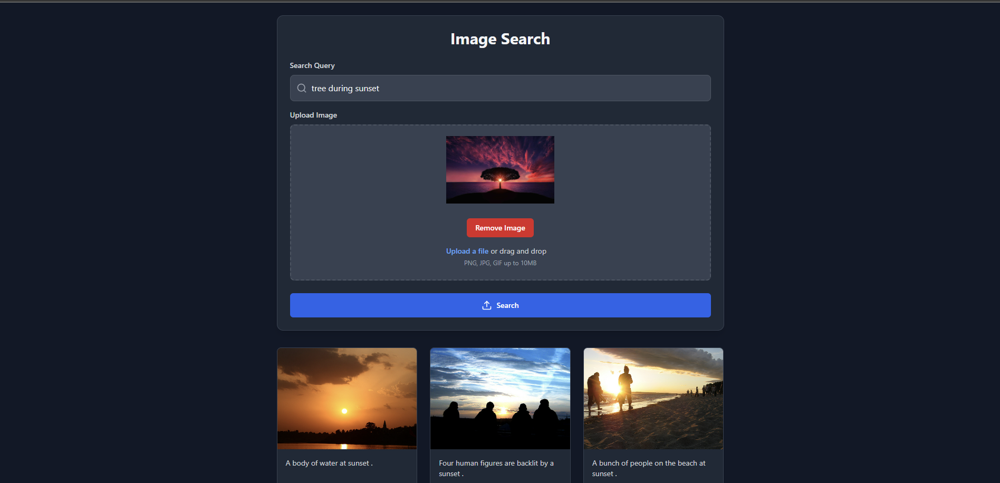

# Image search RAG Application
This application gives user option to search for similar images using either just image or just caption or both.

## Installation & Run
1. Clone this repository using git clone

Navigate to project directory. After that open the terminal and run the following commands in different terminals. This will install all the modules needed to run this app. (change method to activate virtual env for MAC/Linux) 

```bash
  cd backend
  python -m venv venv
  venv\Scripts\activate
  pip install -r requirements.txt
```

```bash
  cd frontend
  npm install
```

To download the dataset needed for api to send image data run following command in terminal at working directory.
```bash
  npm run download
```

To run the app, type the following command in terminal at working directory. it will run both backend and frontend
```bash
  npm run start
```
## Website Preview


## Libraries

- Flask
- Numpy
- Pandas
- Transformers
- ChromaDB
- React.js
- Tailwind CSS


## Authors

- [Akshat Jain](https://github.com/akshat2635)

